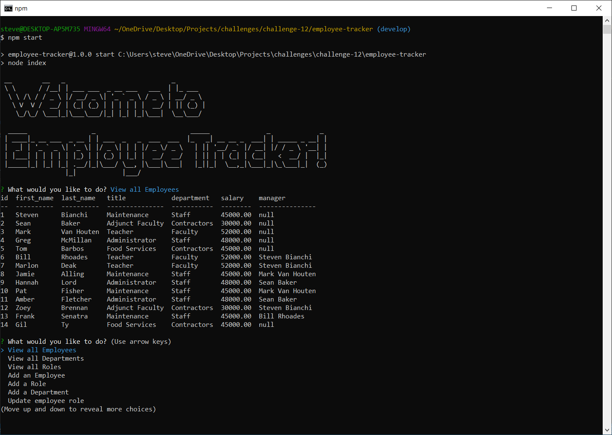

# Employee Tracker
- On start, displays options
- When user selects a "View" option, data is displayed to the console in a table
- When an "Add" option is selected, user is prompted for input. On completion, data is added to the database.Nnew roles and departments are checked for duplicates and data is not added if duplicates are found
- When update is selected, user is presented with update options. Table is updated once all options are selected.
- When exit is selected, program ends

## Repository
- [Repository](https://github.com/SteveB29/employee-tracker)

## Screenshots
